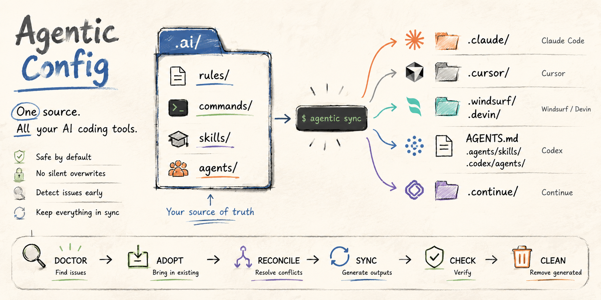

# Agentic Config

**Write AI assistant setup once. Use it across Claude Code, Cursor,
Windsurf/Devin, Codex, and Continue.**

Agentic Config gives your repo one shared place for AI rules, commands, skills,
and agents. It then creates the tool-specific files each AI coding environment
expects.

**Links:** [public repo](https://github.com/Thjodann/agentic-config) ·
[example repo](https://github.com/Thjodann/agentic-config-example) ·
[agent runbook](AGENTIC-CONFIG-RUNBOOK.md)

## 👀 At A Glance

Agentic Config is a translator for repo AI setup:

| Step | What happens |
| --- | --- |
| 1 | You edit shared files in `.ai/` or `.agentic-config/.ai/`. |
| 2 | You run `agentic sync`. |
| 3 | Agentic Config creates the files each AI tool expects. |

```text
Your shared AI config
(.ai/ or .agentic-config/.ai/)
        |
        | agentic sync
        v
Tool-specific files for Cursor, Claude Code, Codex, Windsurf/Devin, and Continue
```

Use Agentic Config when you want everyone on a project to get the same AI guidance, even if
they use different AI coding tools.

**Start here:**

| Goal | Best next step |
| --- | --- |
| I want to set up a real team repo | Follow [Set Up In 3 Minutes](#-set-up-in-3-minutes). |
| I want to try it without risk | Use the [example repo](#-try-agentic-config-safely). |
| I want my AI assistant to do it | Copy the model-led prompt in [Set Up In 3 Minutes](#-set-up-in-3-minutes). |
| I already have AI tool files | Start with [Import Existing AI Tool Files](#-import-existing-ai-tool-files). |

## 🚀 Set Up In 3 Minutes

Requirement: `python3` 3.6 or newer.

**1. Install Agentic Config**

```bash
curl -fsSL https://raw.githubusercontent.com/Thjodann/agentic-config/main/install-agentic-config.sh | sh
```

**2. Confirm the command works**

```bash
agentic --version
```

**3. Open the repo you want to set up**

```bash
cd /path/to/your/repo
```

**4. Initialize Agentic Config**

```bash
agentic init .
```

**5. Check the result**

```bash
agentic doctor
agentic check
```

> [!TIP]
> You are done when `agentic check` says the generated files are in sync, and
> `agentic doctor` does not report conflicts that need manual cleanup.
> If you only needed a standard setup, you can stop here.

**Model-led install**

From inside the repo you want to set up, paste this into your AI coding
assistant:

```text
Please install Agentic Config in this repo.

Use this command if Agentic Config is not installed yet:
curl -fsSL https://raw.githubusercontent.com/Thjodann/agentic-config/main/install-agentic-config.sh | sh

Then run:
agentic init .
agentic doctor
agentic check

Do not delete existing Cursor, Claude, Codex, Windsurf, Devin, or Continue files
unless I explicitly ask. If doctor reports conflicts, stop and explain them.
```

## 🧭 Which Setup Should I Use?

Most people should start with `agentic init .`. Use the other paths when you are
testing, working privately, or bringing existing AI tool files into Agentic Config.

| Situation | Command | What it means |
| --- | --- | --- |
| I want to test Agentic Config safely first | See "Try Agentic Config Safely" below | Uses an isolated example repo made for install, adoption, scanning, and sync tests. |
| I want my team to share this config | `agentic init .` | Creates a committed `.ai/` folder for shared AI setup. |
| I want to try this privately | `agentic init --stealth .` | Creates local-only Agentic Config files without tracked Git changes. |
| This repo already has Cursor, Claude, Codex, or Windsurf files | `agentic doctor` | Shows what can be imported into Agentic Config. |
| I just cloned a repo that already uses Agentic Config | `agentic bootstrap` | Regenerates local AI tool files from the shared source. |
| I want an AI assistant to do this for me | See "Model-led install" above | Gives your assistant a safe setup checklist. |

## 🧪 Try Agentic Config Safely

Use [agentic-config-example](https://github.com/Thjodann/agentic-config-example)
when you want a clonable sandbox instead of testing Agentic Config in a real project.
The example repo is intentionally small and fixture-heavy so you can see how
Agentic Config handles existing native agent folders.

```bash
git clone https://github.com/Thjodann/agentic-config-example.git
cd agentic-config-example
agentic init .
agentic doctor
agentic adopt --all
agentic sync
agentic check
agentic doctor
```

The example repo is useful for testing installation, adoption, scanning, sync
behavior, normal mode, and stealth mode without risking project files.

## 🤖 Let An AI Assistant Set It Up

Use the model-led prompt in [Set Up In 3 Minutes](#-set-up-in-3-minutes) for a
standard setup.

For full agent-assisted setup, update, verify, uninstall, and clean reinstall
instructions, use [AGENTIC-CONFIG-RUNBOOK.md](AGENTIC-CONFIG-RUNBOOK.md).

## 📦 What Agentic Config Adds To A Repo

In a normal team setup, Agentic Config adds:

| Path | Purpose |
| --- | --- |
| `.ai/` | The shared source files people edit. |
| `.ai/.manifest.json` | Tracks what Agentic Config generated. |
| `AGENTS.md` | Repo guidance for tools that read this file. |
| `sync-agentic.sh` | Repo-local compatibility command. |
| `.gitignore` updates | Keeps generated tool folders local when appropriate. |
| Tool-specific folders | Generated files for `.cursor/`, `.claude/`, `.agents/`, `.codex/`, `.windsurf/`, `.devin/`, and `.continue/`. |

The important idea:

- Edit `.ai/`.
- Run `agentic sync`.
- Let Agentic Config update the tool-specific files.

Files named `example-*` are starter templates. Keep them while learning the
format, or replace them with project-specific rules, commands, skills, and agents.

Do not hand-edit files that say `AUTOGENERATED`; Agentic Config will overwrite them.

## 🌓 Normal Mode vs Stealth Mode

Normal mode is best for teams:

```bash
agentic init .
```

It puts the shared source in `.ai/` so it can be committed and reused by everyone.
Usually that means committing `.ai/`, `.ai/.manifest.json`, `.gitignore`,
`AGENTS.md`, and `sync-agentic.sh`. After cloning, each teammate can run
`agentic bootstrap`.

Stealth mode is best for private trials:

```bash
agentic init --stealth .
```

Stealth mode means "no tracked Git changes", not "no files". It stores the source
under `.agentic-config/.ai/`, uses `.git/info/exclude` instead of `.gitignore`,
and generates local files so your AI tools can still find them.

If stealth mode reports that a generated path is already tracked by Git, Agentic Config skips
that path instead of changing tracked project files.

## 📥 Import Existing AI Tool Files

If a repo already has files from Cursor, Claude Code, Codex, Windsurf/Devin, or
Continue, inspect them first:

```bash
agentic doctor
```

If the report looks safe, import everything Agentic Config can adopt automatically:

```bash
agentic adopt --all
agentic sync
agentic check
agentic doctor
```

If `doctor` still reports conflicts or same-name files with different content,
resolve those manually. Agentic Config will not silently choose one version for you.

## 🛠️ Daily Use

| Task | Command |
| --- | --- |
| Update generated tool files after editing `.ai/` | `agentic sync` |
| Check whether generated files are current | `agentic check` |
| Look for conflicts, duplicates, or files that can be adopted | `agentic doctor` |
| Import an existing native file | `agentic adopt <ide> <path>` |
| Import safe exact duplicates | `agentic reconcile --all-exact` |
| Regenerate files after cloning | `agentic bootstrap` |
| Remove generated local files | `agentic clean` |

Common edit flow:

```bash
$EDITOR .ai/rules/service-style.md
agentic sync
agentic check
```

Common cleanup flow for a repo that already had AI tool files:

```bash
agentic doctor
agentic adopt --all
agentic sync
agentic check
agentic doctor
```

## 🧑‍💻 Use The Installed Helper

After Agentic Config is initialized, supported tools can use the built-in
`agentic-config-maintainer` skill or `/agentic-config` command. That means you can
ask your AI assistant for the workflow instead of memorizing CLI options.

Examples:

```text
/agentic-config add a shared rule for our API handler conventions
/agentic-config adopt this Cursor rule into the shared config
/agentic-config reconcile duplicate skills across the repo
/agentic-config demote the generated Cursor commit command
/agentic-config bootstrap this clone
```

Use the direct CLI for scripting, CI, and exact control. Use the helper for
everyday repo maintenance.

## 🔄 Install, Update, Or Remove The CLI

The installer creates a primary command and a compatibility command:

```text
agentic
agentic-config
```

`agentic` is the command used in this README. `agentic-config` remains available
for compatibility. Existing `agc` installs are treated as a legacy alias.

Install from any already-cloned checkout instead of a remote URL:

```bash
./install-agentic-config.sh
```

For later maintenance:

| Task | Command |
| --- | --- |
| Check the installed version | `agentic --version` |
| Check for an update | `agentic update --check` |
| Update the CLI and bundled templates | `agentic update` |
| Preview uninstall | `agentic uninstall --dry-run` |
| Uninstall | `agentic uninstall` |

If the installed command is unavailable, use the standalone uninstaller:

Public GitHub:

```bash
curl -fsSL https://raw.githubusercontent.com/Thjodann/agentic-config/main/uninstall-agentic-config.sh | sh
```

Uninstall removes the Agentic Config-managed CLI files from your user account. It does not
remove repo `.ai/` folders, generated IDE files, or global AI tool assets such as
`~/.codex/skills`.

## 🩺 What Do Doctor And Check Mean?

`agentic check` answers one narrow question:

```text
Do the generated tool files match the current Agentic Config source?
```

`agentic doctor` answers a broader workflow question:

```text
Are there conflicts, duplicates, stale files, unsupported files, or existing tool
files that should be imported?
```

Run `agentic check` in CI. Run `agentic doctor` before committing Agentic Config changes.

## 🧰 Supported Tools

| Tool | Generated surfaces |
| --- | --- |
| Claude Code | `.claude/rules`, `.claude/agents`, `.claude/commands`, `.claude/skills` |
| Cursor | `.cursor/rules`, `.cursor/agents`, `.cursor/commands`, `.cursor/skills` |
| Windsurf/Devin | `.devin/rules`, `.windsurf/workflows`, `.windsurf/skills` |
| Codex | `AGENTS.md`, `.agents/skills`, `.codex/agents` |
| Continue | `.continue/prompts` |

## 🧯 Troubleshooting

| Problem | What to try |
| --- | --- |
| `agentic: command not found` | Restart your terminal, or add the installer's printed bin directory to `PATH`. |
| I am not sure which command is installed | Run `agentic --version`; if that is unavailable, try `agentic-config --version`. |
| `python3` is missing | Install Python 3.6 or newer, then rerun the installer. |
| `agentic check` reports stale output | Run `agentic sync`, then run `agentic check` again. |
| `agentic doctor` reports native-only files | Adopt them with `agentic adopt <ide> <path>`, use `agentic adopt --all`, or leave them native. |
| Stealth mode skips a path | That path is already tracked by Git. Use normal mode, adopt the existing file, or resolve it manually. |
| `curl` is blocked | Install from a local checkout with `./install-agentic-config.sh`, or ask an assistant to follow [AGENTIC-CONFIG-RUNBOOK.md](AGENTIC-CONFIG-RUNBOOK.md). |

## 📚 More Detail

- [github.com/Thjodann/agentic-config](https://github.com/Thjodann/agentic-config)
  is the public source repo.
- [github.com/Thjodann/agentic-config-example](https://github.com/Thjodann/agentic-config-example)
  is the safe example repo for install, adoption, scanning, and sync tests.
- [.ai/README.md](.ai/README.md) explains the canonical file format, frontmatter,
  mappings, safe deletes, and advanced workflows.
- [AGENTIC-CONFIG-RUNBOOK.md](AGENTIC-CONFIG-RUNBOOK.md) is the canonical
  runbook for assistants installing, updating, verifying, uninstalling, or clean
  reinstalling Agentic Config.
- [CHANGELOG.md](CHANGELOG.md) lists release changes.

## 🛡️ Guardrails

- Edit `.ai/` or `.agentic-config/.ai/`, not generated files.
- Run `agentic sync` after changing Agentic Config source files.
- Run `agentic check` before committing.
- Run `agentic doctor` when adopting existing tool files or cleaning up a repo.
- Do not delete native IDE files unless you mean to remove them.
- Keep Codex `.codex/rules/*.rules` as Codex-only execution policy; Agentic Config does not
  treat them as portable team rules.

## 📄 License

MIT. See [LICENSE](LICENSE).
