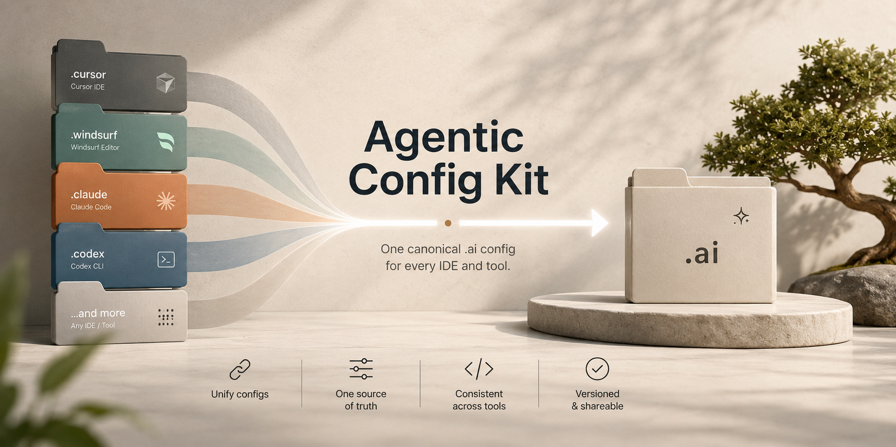

# Agentic Config Kit



Author your AI **rules, agents, slash commands, and skills once** in a neutral
`.ai/` folder, or create them natively in a supported IDE and adopt them into that
shared source of truth.

The kit generates per-IDE config for **Claude Code, Cursor, Windsurf/Devin, Codex,
and Continue** so no teammate is limited by their preferred agentic IDE.

- **Zero dependencies** - Python 3.6+ standard library only.
- **Multi-origin** - native IDE assets can be adopted or reconciled into `.ai/`.
- **Deterministic** - `check` guards against stale committed output.
- **Safe deletes** - generated files and managed blocks are pruned without touching
  hand-written settings, MCP config, hooks, or local preferences.
- **Obsidian-compatible** - `.ai/` is plain Markdown; Obsidian is optional.

## What's in this kit

```
agentic-config-kit/
├── README.md
├── agentic-config
├── install-agentic-config.sh
├── install.sh
├── sync-agentic.sh
├── assets/agentic-config-kit-banner.png
├── hooks/pre-commit
└── .ai/
    ├── INDEX.md
    ├── README.md
    ├── sync.py
    ├── rules/example-repo-guidance.md
    ├── agents/example-code-reviewer.md
    ├── commands/example-summarize.md
    └── skills/example-skill/SKILL.md
```

The `example-*` assets are starter templates. Keep them while learning the format, or
delete them and add your own.

## Install The CLI

Requirement: `python3` 3.6+.

From this checkout:

```bash
./install-agentic-config.sh
```

Or via curl once this repo is available from your internal Git host:

```bash
curl -fsSL <agentic-config-kit-install-url> | sh
```

The installer copies the CLI and bundled templates to:

```text
${AGENTIC_CONFIG_HOME:-$HOME/.local/share/agentic-config-kit}
```

and links `agentic-config` into:

```text
${AGENTIC_CONFIG_BIN:-$HOME/.local/bin}
```

If that bin directory is not on `PATH`, the installer prints the export line to
add. The command is intentionally `agentic-config` in v1 so it does not collide
with other tools named `ai`.

## Initialize A Project

Preferred path:

```bash
agentic-config init /path/to/your/repo
```

This copies `.ai/` and `sync-agentic.sh` into the target repo, adds source-only
ignore rules for generated IDE projections, and runs the first sync. It refuses to
overwrite an existing `.ai/`.

Optional pre-commit guard:

```bash
agentic-config init --install-hook /path/to/your/repo
```

Backward-compatible fallback from this checkout:

```bash
./install.sh /path/to/your/repo
```

Manual install:

```bash
cp -R agentic-config-kit/.ai /path/to/your/repo/.ai
cp agentic-config-kit/sync-agentic.sh /path/to/your/repo/sync-agentic.sh
cd /path/to/your/repo
chmod +x sync-agentic.sh
./sync-agentic.sh
```

## Stealth Mode

Use stealth mode when you want local IDE commands/skills/rules without creating
tracked repo changes:

```bash
agentic-config init --stealth /path/to/your/repo
```

Stealth means **no Git changes**, not no files. It requires a Git repo, then:

- stores local canonical config under `.agentic-config/.ai/`;
- adds `.agentic-config/`, generated IDE folders, and untracked `AGENTS.md` to
  `.git/info/exclude`;
- generates local IDE projections into the repo root so Cursor, Codex, Claude
  Code, Windsurf/Devin, and Continue can find them;
- never edits `.gitignore`.

Safety limits:

- If a generated target path is already tracked, stealth skips it and reports the
  path. Use normal init, adopt the native asset, or resolve it manually.
- If root `AGENTS.md` is already tracked, stealth skips managed `AGENTS.md`
  updates. Codex will still get generated skills/commands, but always-on rule
  fidelity is lower until the repo adopts normal committed config.
- `.agentic-config/.ai/` is local-only. It is useful for personal setup or trials;
  team-wide sharing still comes from committing repo-local `.ai/`.

## Easy mode: ask the installed skill

The easiest way to use the kit is to let your agentic IDE call the built-in
`agentic-config-maintainer` skill or `/agentic-config` command. These are canonical
`.ai/` assets, so `agentic-config init` or `agentic-config init --stealth`
projects them into the supported IDE folders automatically.

Instead of memorizing CLI arguments, ask your model for what you want:

```text
/agentic-config add a shared rule for our API handler conventions
/agentic-config adopt this Cursor rule into the shared config
/agentic-config reconcile duplicate skills across the repo
/agentic-config bootstrap this clone
```

Different IDEs expose the same helper differently: as a slash command, workflow,
prompt, or callable skill. In all cases, the maintainer helper should run
`agentic-config doctor`, choose the safe workflow, edit canonical `.ai/` files,
and finish with `agentic-config sync` plus `agentic-config check`.

In Codex, generated manual commands are explicit-only skills and display with a
`⚡ /command-name` label so they stand apart from reusable skills.

Use direct CLI commands when you are scripting, debugging CI, or want exact control.
Use the installed skill for everyday team contributions.

## Daily use

Canonical-first:

```bash
$EDITOR .ai/rules/service-style.md
agentic-config sync
agentic-config check
```

Native-first:

```bash
# Example: a Cursor user created a project rule in the Cursor UI.
agentic-config doctor
agentic-config adopt cursor .cursor/rules/service-style.mdc
agentic-config sync
```

Duplicate-first:

```bash
agentic-config doctor
agentic-config reconcile --all-exact
agentic-config sync
```

Fresh clone:

```bash
agentic-config bootstrap
```

Recommended source-only commit:

```bash
git add .ai .gitignore AGENTS.md sync-agentic.sh README.md hooks tests
git commit -m "Add shared agentic config"
```

`./sync-agentic.sh` remains supported in repos that prefer a local script or have
not installed the global CLI.

## Where each IDE picks things up

| IDE | Generated surfaces |
| --- | --- |
| Claude Code | `.claude/rules`, `.claude/agents`, `.claude/commands`, `.claude/skills` |
| Cursor | `.cursor/rules`, `.cursor/agents`, `.cursor/commands`, `.cursor/skills` |
| Windsurf/Devin | `.devin/rules`, `.windsurf/workflows`, `.windsurf/skills` |
| Codex | `AGENTS.md`, `.agents/skills`, `.codex/agents` |
| Continue | `.continue/prompts` |

## Guardrails

- Run `agentic-config doctor` before committing.
- Run `agentic-config check` in CI.
- Install `hooks/pre-commit` to block stale output and native-only IDE assets that
  have not been adopted.
- Use `agentic-config clean` to remove generated local IDE projections.
- Use `agentic-config clean --native-duplicates` only for exact native duplicates
  that are already represented in `.ai/`.
- Keep Codex `.codex/rules/*.rules` as Codex-only execution policy; these are not
  portable behavioral rules.
